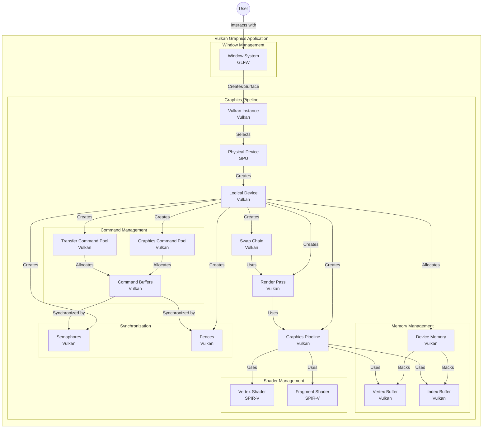

# Rendering 3D Models in Vulkan C++

```mermaid
graph TB
    User((User))

    subgraph "Vulkan Graphics Application"
        subgraph "Window Management"
            GLFW["Window System<br>GLFW"]
        end

        subgraph "Graphics Pipeline"
            VulkanInstance["Vulkan Instance<br>Vulkan"]
            PhysicalDevice["Physical Device<br>GPU"]
            LogicalDevice["Logical Device<br>Vulkan"]
            SwapChain["Swap Chain<br>Vulkan"]
            RenderPass["Render Pass<br>Vulkan"]
            GraphicsPipeline["Graphics Pipeline<br>Vulkan"]
            
            subgraph "Command Management"
                GraphicsCommandPool["Graphics Command Pool<br>Vulkan"]
                TransferCommandPool["Transfer Command Pool<br>Vulkan"]
                CommandBuffers["Command Buffers<br>Vulkan"]
            end

            subgraph "Memory Management"
                VertexBuffer["Vertex Buffer<br>Vulkan"]
                IndexBuffer["Index Buffer<br>Vulkan"]
                DeviceMemory["Device Memory<br>Vulkan"]
            end

            subgraph "Synchronization"
                Semaphores["Semaphores<br>Vulkan"]
                Fences["Fences<br>Vulkan"]
            end

            subgraph "Shader Management"
                VertexShader["Vertex Shader<br>SPIR-V"]
                FragmentShader["Fragment Shader<br>SPIR-V"]
            end
        end
    end

    %% Relationships
    User -->|"Interacts with"| GLFW
    GLFW -->|"Creates Surface"| VulkanInstance
    VulkanInstance -->|"Selects"| PhysicalDevice
    PhysicalDevice -->|"Creates"| LogicalDevice
    LogicalDevice -->|"Creates"| SwapChain
    LogicalDevice -->|"Creates"| RenderPass
    LogicalDevice -->|"Creates"| GraphicsPipeline

    GraphicsPipeline -->|"Uses"| VertexShader
    GraphicsPipeline -->|"Uses"| FragmentShader

    LogicalDevice -->|"Creates"| GraphicsCommandPool
    LogicalDevice -->|"Creates"| TransferCommandPool
    GraphicsCommandPool -->|"Allocates"| CommandBuffers
    TransferCommandPool -->|"Allocates"| CommandBuffers

    LogicalDevice -->|"Allocates"| DeviceMemory
    DeviceMemory -->|"Backs"| VertexBuffer
    DeviceMemory -->|"Backs"| IndexBuffer

    LogicalDevice -->|"Creates"| Semaphores
    LogicalDevice -->|"Creates"| Fences

    SwapChain -->|"Uses"| RenderPass
    RenderPass -->|"Uses"| GraphicsPipeline
    GraphicsPipeline -->|"Uses"| VertexBuffer
    GraphicsPipeline -->|"Uses"| IndexBuffer
    CommandBuffers -->|"Synchronized by"| Semaphores
    CommandBuffers -->|"Synchronized by"| Fences
```
